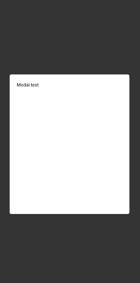

# react-native-alert-utils

This lib provide some basic types of alert on your app.

## Usage

```javascript
import AlertProvider from 'react-native-alert-utils';

<Providers>
    <NavigationProvider>
        <Router />
------> <AlertProvider />
    </NavigationProvider>
</Providers>
```

After set provider on your root app, you can use methods to show modal inside your screens, by default, you can all customize your modal, defining the component will'be show, but, if you like a fast usage, we provide a basic layout of modal.

### Showing modal



```javascript
import { setModal } from 'react-native-alert-utils';
import { SimpleLayout } from 'react-native-alert-utils/Layout';

const Screen = () => {

  const SimpleModal = () =>
    <SimpleLayout>
      <Text>Modal test</Text>
    </SimpleLayout>

  return (
    <View>
      <Button onPress={() => setModal(<SimpleModal />)} />
    </View>
  )
}
```

## Methods

Name | Params | Description
--- | --- | ---
pushModal | `Component[]` | Push list of components to screen
popModal |  | Pop first modal of screen, if exists
setModal | `Component`, [`Options?`](#options) | Set modal on screen, you can add some options using a object
hideModal |  | Hide modal from screen
showModal |  | Show modal on screen if have some 

## Layouts

You can get layouts from:
```javascript
import { ... } from 'react-native-alert-utils/Layout'
```

Name | Props | Description
--- | --- | ---
SimpleLayout | [`Container`](#container) | Simple layout used on example

## Types

### Options

Name | Type | Required | Default | Description
--- | --- | --- | --- | ---
fixed | `boolean` | No | `false` | If true, the modal cannot be hide on click outside, then you need to provide way to hide.

### Container

Name | Type | Required | Default
--- | --- | --- | --- | ---
backgroundColor | `string` | `false` | `#FFF`
height | `number` \| `%` | `false` | `50%`
width | `number` \| `%` | `false` | `90%`
padding | `number` | `false` | `20`
